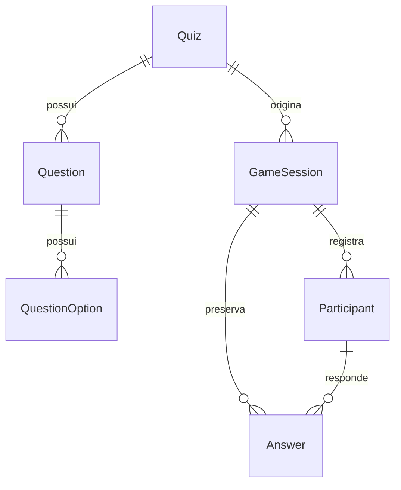

# Modelo persistente do QuizArena

## Projeções do lobby

PostgreSQL guarda a confirmação de `GameSession`, o snapshot histórico e `Participant`, incluindo somente hashes de tokens. Redis usa o prefixo `quizarena:lobby:` para `room:<ROOM_CODE>` (DTO público), `presence:<ROOM_CODE>:<PARTICIPANT_ID>` (presença efêmera) e `rate:<KIND>:<IDENTITY>` (janelas atômicas). A projeção e a presença usam `LOBBY_TTL_SECONDS`; rate limits usam TTL próprio. Redis não é fonte permanente e a projeção é reconstruída do PostgreSQL.

## Tabelas e relacionamentos

| Entidade       | Responsabilidade                                           | Integridade e índices                                                                                                         |
| -------------- | ---------------------------------------------------------- | ----------------------------------------------------------------------------------------------------------------------------- |
| Quiz           | Catálogo editável, título, descrição e ciclo de publicação | UUID; título não vazio/normalizado; índice por status                                                                         |
| Question       | Enunciado, ordem, duração, pontos e explicação             | FK para Quiz; posição única por quiz e positiva; 5–120 segundos; 100–10.000 pontos                                            |
| QuestionOption | Texto e indicação de alternativa correta                   | FK para Question; posição única por pergunta e positiva; texto não vazio                                                      |
| GameSession    | Ocorrência de jogo e cópia histórica do quiz               | Código público único; FK restritiva para Quiz; JSONB; hash scrypt; índice por status/data e por quiz                          |
| Participant    | Identidade local da sessão e total persistido              | Nome normalizado único por sessão; FK restritiva; score inteiro não negativo; hash scrypt                                     |
| Answer         | Decisão de resposta calculada no servidor                  | Resposta única por sessão/participante/pergunta; FK composta garante participante da mesma sessão; tempo/pontos não negativos |

UUIDs são atribuídos pelo Prisma. Datas usam `TIMESTAMPTZ(3)`, defaults do PostgreSQL e instantes UTC. A aplicação retorna `Date` nos registros e somente valores JSON no snapshot.

## Exclusão e histórico

Questões e alternativas usam cascata somente dentro do catálogo editável. Sessões, participantes e respostas usam `ON DELETE RESTRICT`; excluir um quiz com sessão é bloqueado. Não há operações públicas de exclusão neste incremento.

`Answer.questionRef` e `selectedOptionRef` são UUIDs do snapshot, sem FK para as tabelas editáveis. Mesmo após editar ou excluir uma pergunta original, a resposta permanece interpretável pelo JSON histórico. A FK composta `(participantId, gameSessionId)` impede associar respostas a participantes de outra sessão.

Os índices compostos iniciados por `gameSessionId` atendem buscas de participantes e respostas por sessão, sem índices redundantes.

## Regras de domínio versus banco

Os serviços usam transações `Serializable` em operações compostas e repetem até três tentativas em conflitos de serialização. Violações de unicidade são traduzidas para códigos de domínio.

- Serviço: título trim, validação Zod, ao menos uma pergunta na publicação, 2–6 alternativas, exatamente uma correta, normalização NFKC/trim/espaços/case do participante, referências ao snapshot e transições permitidas.
- Banco: PKs, FKs, unicidades, valores numéricos, textos essenciais não vazios, formato do código de sala, formato de hashes, raiz/versionamento/vínculo básico do snapshot e trigger de imutabilidade.
- A quantidade de alternativas e exatamente uma correta **não** são garantidas por índice simples; são verificadas dentro da transação do serviço, inclusive ao publicar.
- A normalização completa de nomes é responsabilidade do serviço. O banco torna única a chave normalizada recebida.
- A validade interna completa do JSON e a existência das referências de Answer no snapshot são verificadas pelo serviço. SQL direto não substitui essa validação.

## Ciclos de vida

Quiz nasce `DRAFT`. Somente rascunhos aceitam perguntas. Publicação exige validação completa e registra `publishedAt`. Arquivamento registra `archivedAt`. Republicar `ARCHIVED` é proibido; não há desarquivamento neste incremento.

Sessão nasce `WAITING` e aceita participantes nesse estado. Respostas exigem `ACTIVE`; finalização exige `ACTIVE` e é idempotente para `FINISHED`. `CANCELLED` está reservado no modelo. **Ainda não há comando público para iniciar ou cancelar sessão**; os testes preparam ACTIVE diretamente como fixture. Essas transições serão integradas ao próximo domínio realtime, sem alteração da interface agora.

O score do participante começa em zero. Registrar resposta persiste `isCorrect`, `responseTimeMs`, `pointsAwarded` e horário do servidor; não executa algoritmo de pontuação nem incrementa o score. A coerência de `isCorrect` com a alternativa histórica é validada. Os demais valores da decisão devem vir de código confiável do servidor, nunca diretamente do navegador.

## Snapshot v1

`buildQuizSnapshot(quizId)` lê o quiz completo em uma transação, exige publicação, ordena perguntas e alternativas, valida com Zod e devolve uma cópia profundamente congelada.

Contém `schemaVersion: 1`, `quizId`, `title`, perguntas com UUID/posição/enunciado/tipo/duração/pontos/explicação e alternativas com UUID/posição/texto/correção. É autossuficiente, serializável e não contém objetos Prisma.

O serviço de criação de sessão aceita esse snapshot como entrada interna confiável, revalida o JSON e exige que o quiz referenciado ainda esteja publicado. Não deve receber snapshots arbitrários do navegador. Ele não gera código de sala nem token.

A migration instala `GameSession_snapshot_immutable`, que rejeita mudanças de conteúdo em `quizSnapshot` ou no `quizId` da sessão com SQLSTATE 23514. Updates de status/datas e escrita do mesmo JSON continuam permitidos. A comparação é JSONB, independente da ordem das chaves.

O teste PostgreSQL `trigger bloqueia snapshot e quizId, permite atualizações legítimas` comprova ambas as situações. Outro teste altera o título e exclui perguntas originais, registra resposta e verifica a preservação histórica.

## Tokens

O chamador fornece tokens com 32–512 caracteres. O serviço aplica scrypt (N=16384, r=8, p=1), salt aleatório de 16 bytes e saída de 64 bytes. O formato persistido é `scrypt$v1$saltHex$hashHex`; tokens originais não são persistidos. O banco recusa formato plaintext nos campos de hash. DTOs de sessão/participante omitem hashes.

Geração, validação de posse, autenticação, revogação e transporte dos tokens estão adiados. O chamador futuro deverá fornecer tokens criptograficamente imprevisíveis; comprimento por si só não comprova entropia. O snapshot inclui gabaritos e é dado interno do servidor: endpoints futuros precisarão de DTOs específicos para os jogadores.

## API do pacote

`createDatabase({ databaseUrl })` retorna:

- `quizzes.createDraft(input)`, `getById(id)`, `addQuestion(id, input)`, `publish(id)`, `archive(id)`, `listByStatus(status)`, `buildQuizSnapshot(id)`.
- `sessions.create({ roomCode, snapshot, hostToken })`, `getById(id)`, `getByCode(code)`, `registerParticipant({ gameSessionId, displayName, reconnectToken })`, `registerAnswer(decision)`, `finish(id)`.
- `close()`: desconecta Prisma.

`createDatabaseHealthProbe(databaseUrl)` expõe apenas `check()` e `close()`. Importar o pacote não abre conexão. Prisma não é exportado pela API pública.

Erros esperados incluem `QUIZ_NOT_FOUND`, `QUIZ_INVALID`, `QUIZ_NOT_PUBLISHED`, `QUIZ_NOT_DRAFT`, `QUIZ_ARCHIVED`, `QUESTION_POSITION_CONFLICT`, `ROOM_CODE_CONFLICT`, `PARTICIPANT_NAME_CONFLICT`, `ANSWER_ALREADY_SUBMITTED`, `SNAPSHOT_REFERENCE_INVALID`, `ANSWER_DECISION_INVALID`, `SESSION_NOT_ACTIVE` e `TRANSACTION_CONFLICT`. Use `error.code`, não a mensagem textual.

## Migration, seed e isolamento dos testes

`pnpm db:migrate` aplica migrations versionadas com `prisma migrate deploy`. Não há `db push`, criação de tabelas em runtime nem seed embutido no SQL.

A migration inicial foi gerada com `prisma migrate diff --from-empty --to-schema-datamodel prisma/schema.prisma --script`; antes da primeira aplicação, recebeu CHECKs e trigger. A instrução fixa de criação de public foi removida para respeitar o schema da URL. O SQL aplicado não deve ser reescrito; evoluções exigem nova migration.

`pnpm db:seed` cria em uma transação o quiz publicado **Conhecimentos Gerais**, com UUID fixo, seis perguntas e quatro opções cada. Reexecuções preservam o mesmo registro e não alteram conteúdo existente. Se o UUID estiver ocupado por outro título/estado, falha com `SEED_CONFLICT`. Não cria sessões, participantes ou respostas.

Configure `packages/database/.env`:

- `DATABASE_URL`: schema de desenvolvimento (padrão public).
- `TEST_DATABASE_URL`: obrigatoriamente schema `quizarena_test`, diferente do desenvolvimento.

Execute `pnpm db:test:prepare` para aplicar a mesma migration no schema isolado. Não apaga dados. Testes reais não usam mocks de Prisma; criam registros com IDs próprios e removem **somente esses IDs**, em ordem de FK, no schema validado. O seed de teste permanece no schema de teste. A suíte compara as contagens de quizzes/sessões/participantes/respostas do desenvolvimento antes e depois para detectar interferência.

`pnpm test` e `pnpm check` exigem PostgreSQL e ambos os schemas preparados; testes não são silenciosamente ignorados sem banco. `pnpm test:unit` não exige PostgreSQL. Não há reset, truncate ou drop automático.

## Limitações

Sem autenticação, ownership, API administrativa, rotas de domínio, eventos de partida, geração de códigos/tokens, cronômetros, estado de partida em Redis ou cálculo realtime. PostgreSQL é permanente; Redis continua destinado a dados efêmeros.
